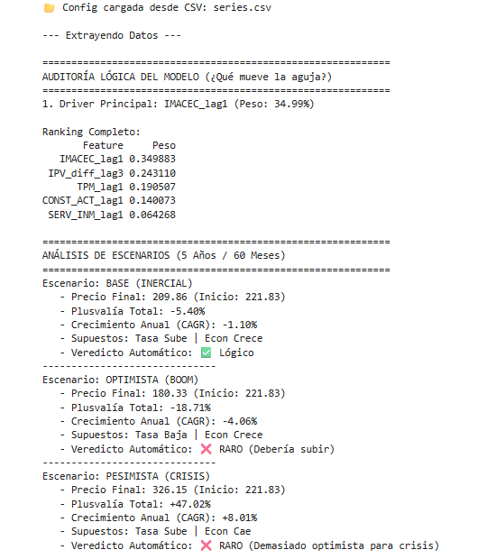
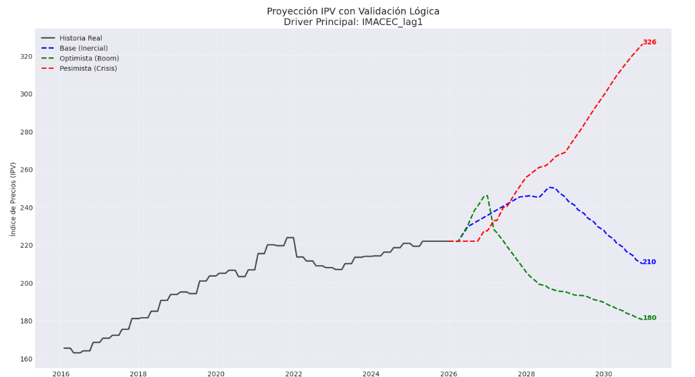

# RealEstate-XGBoost-Forecaster

Este mini lab implementa un modelo de ML: **Pronóstico Recursivo (Recursive Multi-step Forecasting) usando XGBoost**. Este ejercicio fue desarrollado en **SageMaker Studio**. Utiliza un dataset pequeño (180 filas mensuales, 2010-2025) para predecir 5 años (60 meses) en el mercado inmobiliario. Los datos se obtienen de la API del Banco Central de Chile "Base de Datos Estadísticos (BDE)".

Predecir 5 años en economía es un horizonte extremadamente largo con alta incertidumbre. Los modelos tradicionales pierden precisión exponencialmente después de 12-24 meses. Para mitigar esto, usamos Pronóstico Recursivo con XGBoost, ya que los datos económicos mensuales son escasos para Deep Learning (e.g., LSTM), y XGBoost maneja mejor relaciones no lineales en datasets pequeños.

## 1. Ranking de Variables
- **Qué muestra:** Importancia de cada feature según XGBoost (F-score). Explica "qué mueve el precio".
- **Drivers principales:** `IPV_diff_lag3` e `IMACEC_lag1` dominan.

## 2. Auditoría Lógica + Escenarios (Texto con tablas y veredictos)
- **Qué muestra:** Peso normalizado de cada driver; driver principal del modelo (`IMACEC_lag1`); tres escenarios simulados (Base, Optimista, Pesimista); veredicto lógico automático para detectar inconsistencias (ej. "optimista → debería subir").

## 3. Proyección IPV con Escenarios (Imagen 3 – Gráfico de líneas)
- **Qué muestra:** Serie histórica del precio y las proyecciones en 60 meses para los escenarios Base, Optimista y Pesimista.
- **Valores finales:** Base (Inercial): `210`; Optimista (Boom): `180`; Pesimista (Crisis): `326`.
- **Divergencia:** Cada trayectoria diverge claramente mostrando distintos riesgos y oportunidades.

## Reflexión de los Datos
El modelo identifica el **IMACEC** (actividad económica) y los rezagos del propio índice de precios (**IPV**) como los principales predictores.

---
**Nota:** Esta es la primera prueba de concepto con estos datos. Pueden existir errores de interpretación, sesgos en los datos de entrenamiento o limitaciones en la lógica del modelo.
