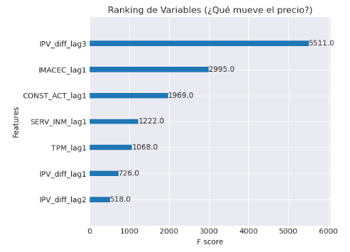

# RealEstate-XGBoost-Forecaster

Este mini lab implementa un modelo de ML: **Pronóstico Recursivo (Recursive Multi-step Forecasting) usando XGBoost**. Este ejercicio fue desarrollado en **SageMaker Studio**. Utiliza un dataset pequeño (180 filas mensuales, 2010-2025) para predecir 5 años (60 meses) en el mercado inmobiliario. Los datos se obtienen de la API del Banco Central de Chile "Base de Datos Estadísticos (BDE)".

Predecir 5 años en economía es un horizonte extremadamente largo con alta incertidumbre. Los modelos tradicionales pierden precisión exponencialmente después de 12-24 meses. Para mitigar esto, usamos Pronóstico Recursivo con XGBoost, ya que los datos económicos mensuales son escasos para Deep Learning (e.g., LSTM), y XGBoost maneja mejor relaciones no lineales en datasets pequeños.

## Resultados Preliminares

### Proyección a 5 Años

### Importancia de Variables

### Auditoría del Modelo

## Reflexión de los Datos
El modelo identifica el **IMACEC** (actividad económica) y los rezagos del propio índice de precios (**IPV**) como los principales predictores.

Sin embargo, se observa un comportamiento **contraintuitivo** en los escenarios extremos:
- El escenario **Pesimista** proyecta un aumento agresivo de precios.
- El escenario **Optimista** proyecta una caída.

Esto podría indicar que el modelo ha aprendido correlaciones históricas específicas (ej. crisis inflacionarias elevando precios nominales) o que existen limitaciones al generalizar comportamientos en horizontes tan largos con pocos datos.

---
**Nota:** Esta es la primera prueba de concepto con estos datos. Pueden existir errores de interpretación, sesgos en los datos de entrenamiento o limitaciones en la lógica del modelo.
